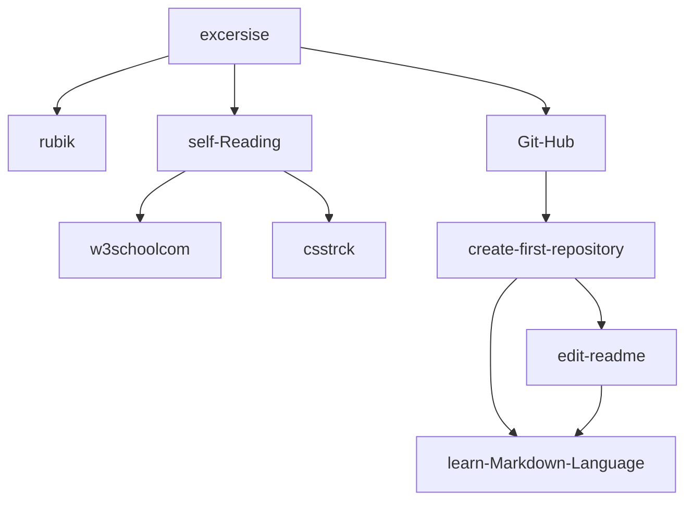

# My first Readme
### I love Git-hub

just test :sweat_smile: 

first paragraph
  
second paragraph  
new line by double space
  
|:hourglass:    | first class   |  second class |
|-------------  | ------------- | ------------- |
|  2 hour       | rubik         | git-hub :+1:  |
|  1 hour       |  learn from english refrence | refrence for learning HTML  |

:memo: this language as same as **LATEX**
  
  

  

usefull link 

  
 [Markdown](https://docs.github.com/en/get-started/writing-on-github/getting-started-with-writing-and-formatting-on-github/basic-writing-and-formatting-syntax)  
[Peter Norvig](https://www.udacity.com/blog/2014/01/peter-norvig-teach-yourself-programming.html)  
  [w3schools](https://www.w3schools.com/html/default.asp)  
  [rubik](https://rubiks.com/)    
  [وب](https://css-tricks.ir/)
 

excersise Chart 

  

  
  

  
  

Load Image 

  
    #### first exercise  _learn rubik_ 
    
  
  
 

 >Thanks to  **Mr Mihandoost**  :heart:
[AliMD](https://github.com/AliMD).
