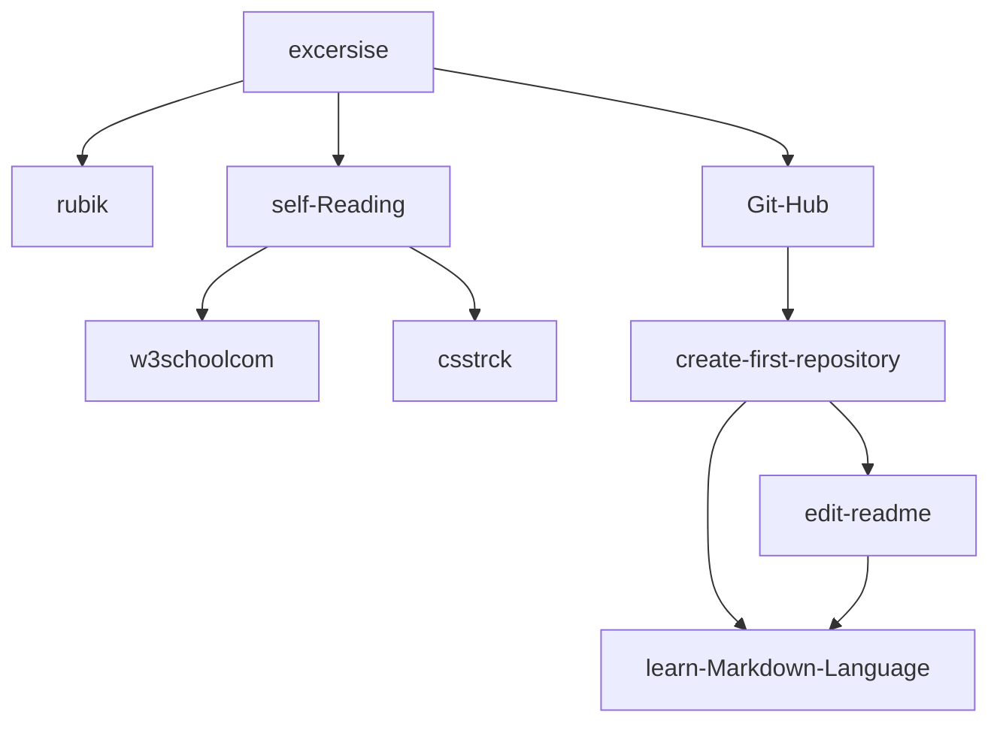

# This is a main Title
## and this is subtitle

just test :sweat_smile: 

first paragraph
  
  
second paragraph  
new line
|:hourglass:    | first class   |  second class |
|-------------  | ------------- | ------------- |
|  2 hour       | rubik         | git-hub :+1:  |
|  1 hour       |  learn from english refrence | refrence for learning HTML  |

:memo: this language as same as **LATEX**
  
  

  

>Thanks to  **Mr Mihandoost**  :heart:
[AliMD](https://github.com/AliMD).

#### first exercise  _learn rubik_ 

